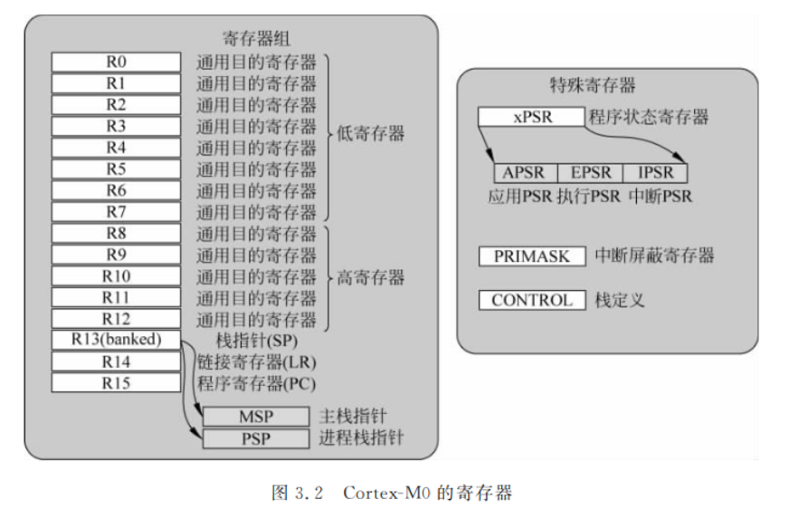
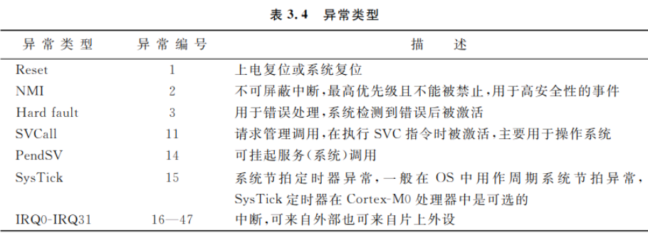
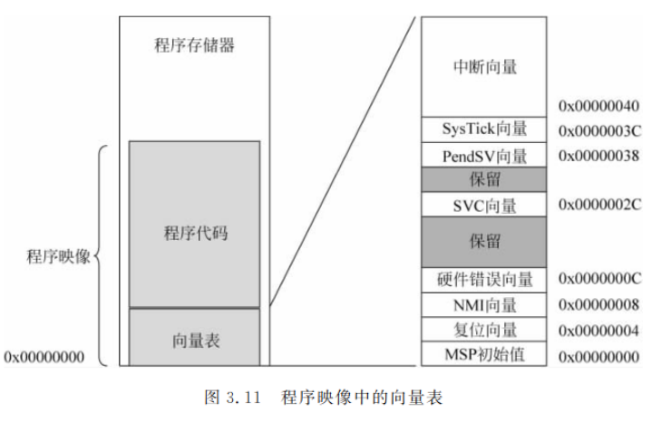
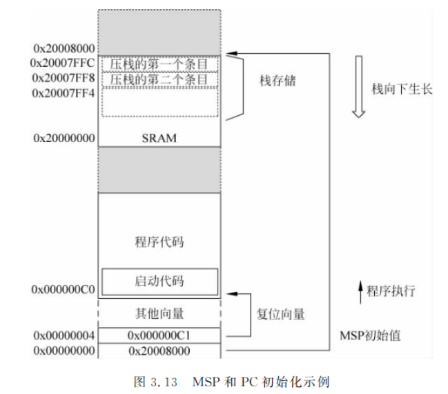
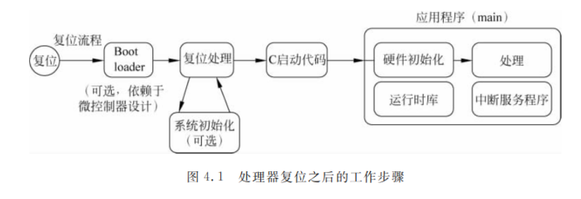
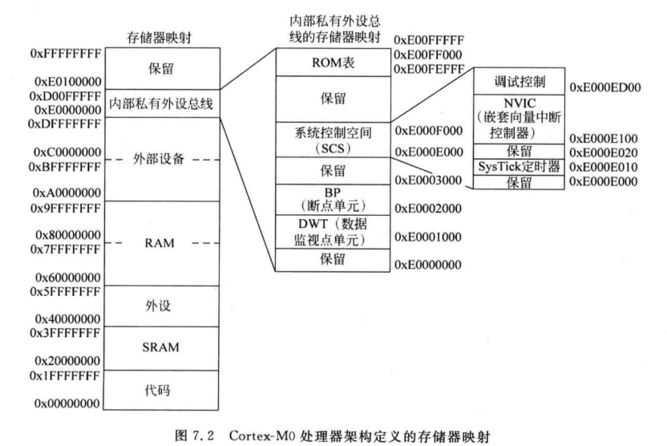

[toc]
------------------------------
# Cortex-M0
Cortex-M0简单框图:

# 体系结构
使用c语言开发Cortex-M0设备，只需了解存储器映射、外设操作方法、异常处理机制和系统模型的一部分

## 系统模型

### 操作模式和状态

Cortex-M0包含两种操作模式和两种状态：

* 模式
	* Thumb状态
	* 调试状态
* 模式
	* 线程模式：执行普通代码
	* 处理模式：执行异常处理

### 寄存器和特殊寄存器
Cortex-M0中的寄存器：

### 寄存器介绍
* R0~R12  
为通用寄存器，其初始值未定义。
* R13  
    * 作用：为栈寄存器(SP)，用于对栈空间的存取操作
    * 指令：`push, pop`
    * 分类：Cortex-M0 在不同的物理位置上有两个栈指针：  
        * 主栈指针(MSP): 默认指针，用于异常处理
        * 进程栈指针:只能用在线程模式，可通过配置CONTROL寄存器，选择使用哪个栈指针。
* R14  
为链接寄存器，用于存储子程序或函数调用的返回地址。
* R15  
程序计数器(PC)，可读可写。读操作返回当前正在执行的指令地址+4，写入会导致程序跳转执行。
### xPSR 组合程序状态寄存器
* 该寄存器有三个程序状态寄存器组成:
    * 用用程序状态寄存器 APSR
    * 中断程序状态寄存器 IPSR
    * 执行程序状态寄存器 EPSR
## 存储器系统
Cortex-M0 有4G的存储器地址空间。在体系结构上，存储器空间被分为一系列的区域，每个区域都有推荐的用途：

## 异常和中断
1. 异常会引起程序控制的变化。当异常发生时，处理器停止当前任务，转而执行异常处理程序，处理完成后继续执行刚才暂停的任务。
2. 异常分为多种，中断是其中一种，还有一些异常被用于操作系统和错误处理:

3. 中断事件的异常处理被称为中断服务程序
## 程序映像和启动流程
1. 程序映像中的向量表

2. 复位流程

3. MSP和PC初始化示例

# Cortex-M0 编程入门
## 微控制器启动流程
程序烧写到Flash存储器后，处理器就可访问了。复位流程如下：

* 应用程序包含：  
    * 硬件初始化
    * 应用程序的处理部分
    * 中断服务程序
### 嵌入式程序设计
* 应用程序处理流程的实现方式
    * 轮询
    * 中断驱动
    * 轮询+中断驱动
    * 处理并发任务:其中时间片的使用就体现了并发处理的思想
## 程序映像
Cortex-M0的程序映像包含：  
* 向量表:和编译器相关
* C 启动例程:完成数据和堆空间的初始化，完成后跳转到mian()程序
* 程序代码(应用程序代码和数据)
* C 库代码(库函数代码，链接时插入)
## 用C语言操作外设
* 操作原理：将外设寄存器映射到系统存储器空间，然后通过指针进行访问
* 访问方法：  
    * 使用微控制器提供商提供的设备驱动
    * 直接访问(UART寄存器指针定义以及寄存器访问示例)：
        ```c
        // 定义指针
        #define UART_BAE    0x40003000 // ARM Primecell PL011 的基地址
        #define UART_DATA   (*((volatile unsingned long *)(UART_BASE + 0x00)))
        // ...
        // ...
        // 使用——发送一个字符
        int sendchar(int ch)
        {
            while(UART_FLAG & 0x20); // 忙，等待
            UART_DATA = ch;             // 写字符
            return ch;
        }
        ---------------------------------------------------------------
        // 为了简化代码，可将外设寄存器组定义为结构体，而将外设当作指向这个结构体的指针
        // 定义
        typedef struct { // 基于 ARM Primecell PL011
            volatile unsigned long DATA;    // 0x00
            volatile unsingned long RSR;    // 0x04
            // ...
            // ...
        } UART_TypeDef;

        #define Uart0 ((UART_TypeDef *)0x40003000)
        #define Uart1 ((UART_TypeDef *)0x40004000)
        // 使用——发送一个字符
        int sendchar(int ch)
        {
            while(Uart0->Flag & 0x20);
            Uart0->Data = ch;
            return ch;
        }
        ```
# 指令集
## 指令集列表
 ### 指令集的划分
根据功能可以将Cortex-M0处理器的指令划分为不同的组：  
|分类                   |指令                                           |
|-------------------    |-------------------------------------------    |
在处理器内部移动数据    |MOV,MOVS,ADDS,MRS, |
存储器访问              |LDR,STR,|
栈空间访问              |PUSH,POP,|
算术运算                |ADDS,|
逻辑运算                |AND,OR,|
位移和循环操作          ||
展开和顺序反转操作      ||
程序流程控制            ||
存储器屏障指令          ||
异常相关指令            |SVC|
其他功能                |休眠(WFI-等待中断,WFE-等待事件)|
# 存储器系统
Cortex-M0处理器架构定义的存储器映射:

